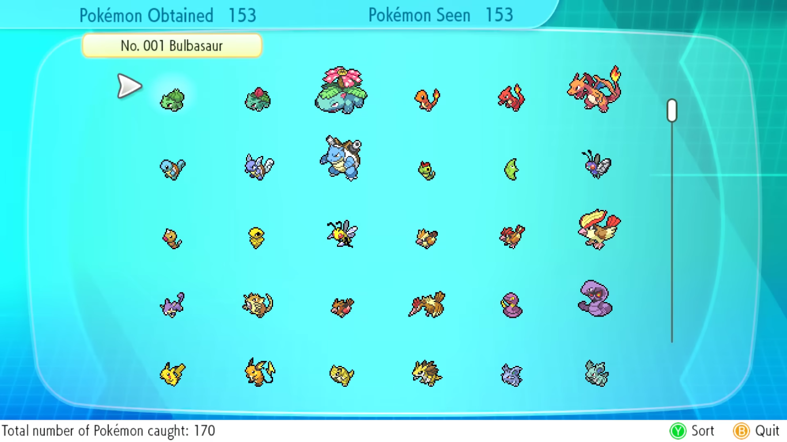

# PostgreSQL study with a Pokédex

This repository mine, for studying purposes, tests my entire knowledge of databases, particularly how to make fetches and manage them.


## Content
1. [Databases (SQL)](#databases-sql)
   1. [Manipulation](#manipulation)
1. [Some worryings about databases...](#some-worryings-about-databases)
   1. [SQL Injection](#sql-injection)
   1. [_JSON_, _HStore_ and _MongoDB_ goes against the databases' 1NF](#json-hstore-and-mongodb-goes-against-the-databases-1nf)
1. [Databases based on... Pokédex](#databases-based-on-pokédex)
1. [Functional and non-functional requirements](#functional-and-non-functional-requirements)
   1. [Functional](#functional)
   1. [Non-functional](#non-functional)
 


## Databases (SQL)
To introduce, I should describe, based on my own words, what is, in _stricto sensu_, a database management system (__DBMS__).

That is basically an area that studies organize and manipulate a massive amount of things (info) of a certain set (knowledge) with proper characteristics (data), including a mandatory identifying numerical code (primary key).

These sets are huge, with the possibility of being the amount, in numbers, of:

* Employees of a company (identifying by their __ID number__);
* Distinct products salable in a supermarket and their  (identifying by the __barcode__);
* Candidates of political positions, all of them in a party, registered in a voting machine in elections period (identifying by the __vote number__);
* Books available in a library or bookstore (identifying by the __ISBN number__).

Being the sets above an abstract of reality, there is basically a _big data_ with _megabytes_ or _gigabytes_ of existing info inside a table, or a database in general, and that only considering values in text. The size may be higher than a value in _terabytes_ if audio, images, videos and executable programs were considered.


### Manipulation
To make the data manipulation and indexation easier, which are of huge amounts in a table, a programming language was invented called _Structured Query Language_, popularly known as __SQL.__

This is a high level language (close to human languages) and, similar to the vast majority of the programming languages, based on the English language, reserving multiple words and terms from the same language (`CREATE, ALTER, DROP, INSERT, ADD, IF NOT EXISTS, UPDATE, SET, DELETE, SELECT, JOIN, UNION ALL, CONCAT, ORDER BY, ASC, DESC, FROM, WHERE, LIKE, TABLE, COLUMN, PRIMARY KEY, CONSTRAINT, FOREIGN KEY, REFERENCES, TEXT, INT, VARCHAR, FLOAT, SERIAL, BOOLEAN, BEGIN TRANSCATION, COMMIT, ROLLBACK`, etc.) to convert them in electric pulses comprehensible to the computer's hardware and make operations in a database, with the possibility of being an entire table or an specific entry inserted inside the former.

To know if a word or term is reserved in a code, as shown in the blockcode above, they are highlighted depending on the text editor used for writing SQL commands. In the case of _Ubuntu Text Editor_, they are marked in __bold__ and in beige color. On [OneCompiler](http://onecompiler.com/postgresql), they are marked in magenta.

The manipulation commands should follow the pillars of the __ACID:__
* __*Atomicity:*__ Either the commands are totally succeeded or, in case there is an exception or something invalid, not succeeded. There is no "half-doing" or partial progression. In case of a value insertion done in a table's row, if an error or exception is thrown (eg.: attributing a _text_ in an _integer_ cell), no data will be inserted. The commands must be corrected.
* __*Consistency:*__ The data should be consistent based on a command. Imagine a __R$1000__ balance in a bank account, in which two Pix happen: one of __+R$500__ received and one of __-R$200__ made, respectively on that order. If there were no mutual exclusion on these Pix, there would be a race condition (inconsistency), because, due to the latter __-R$200__ of debit, the final balance would be shown as __R$800__, ignoring the former __+R$500__ of credit. Or __R$1500__, if the order of the Pix were inverted. To remedy the problem, both Pix will have a _mutex_ semaphore. Now that's the situation the consistency is right, having the expected __R$1300__ of account balance.
* __*Isolation:*__ Basically the said before mutual exclusion of accessing a data value by a command, that to avoid race conditions.
* __*Durability:*__ If an operation is done, the data later remain unaltered, even with consequences after human or external threats.

From the basic SQL, since then appeared variants of the same for better adaptation and solutions for specific problems, like _SQLite, PostgreSQL, MySQL, Microsoft SQL Server, NoSQL (MongoDB, Cassandra, etc.), PL/SQL, etc._ Also related to SQL, since then appeared database softwares for amateurish people like the _Microsoft Access_ and identical premises from alternative suites (_LibreOffice Base, OpenOffice Base,_ etc.).


## Some worryings about databases...
### SQL Injection
Similar to every IT technology, there are worryings regarding about security. Attentions should be paid to confidentiality (in which only authorized people are able to access), integrity (in which no data was modified) and availability (in which the content should be available and stable 24/7).

For an specific example of DBMS, there is an attack called _SQL Injection,_ in which a hacker can exploit vulnerabilities (eg.: data collection on milliseconds of response time, concatenation with non-confidential data, etc.) in a database of basically something (website, store, company, etc.) and collect sensitive and confidential info (ex.: passwords) for criminal and fraudulent purposes with the same. Like, using them to sell on dark web, use passwords to crack and invade someone's bank account and either waste money or leak their statement on the internet, replace someone's social network account for something to promote fraudulent cryptocurrency transactions, and other stuff.

### _JSON_, _HStore_ and _MongoDB_ goes against the databases' 1NF
This repo did not use these type of data. But in PostgreSQL, usually the columns in JSON or HStore format break the first normal form (1NF) of a database. Same for MongoDB. Despite them being declared as _NoSQL_ ("not only SQL"), there is still something weird.

The normal forms are declared like the following:
* __1NF:__ Each cell should not have more than one value. In a table containing videogames in a store, for example, a game should not have more than one publisher. A secondary table should be created, with a foreign key referencing its ID, related to it with different publishers, depending on the platform, the media format or region.
* __2NF:__ From what I understand, the values in a table should not depend partially of a primary key. But basically, the tables should not have more than one primary key. In a table containing government IDs and employee IDs of people, for the example of the staff of a company. The column that requires an `employee_id` value (int), that one being the primary key, should be in a secondary apart table, with the `gov_id` being the foreign key.


## Databases based on... Pokédex

The reason why I chose Pokémon in a Pokédex because that is the very best subject I have a thing with to train database manipulation. That is an allusion based on the four examples mentioned above.

The database will focus on Pokémon from the 1st generation and their evolutions, megaevolutions, gigantamaxes and regional formes from later games. The tables are created like the following:
```sql
Create table if not exists Pokedex
(Pkdx smallserial, Pkmn varchar(10) not null, Gen int not null,
 EvFrom varchar(10), EvTo varchar(10),
 Type1 varchar(6) not null, Type2 varchar(6),
 Abil varchar(12) not null,
 Mega int not null, Gmax bool not null,
 Primary key (Pkdx));

Insert into Pokedex (Pkmn,Gen,EvFrom,EvTo,Type1,Type2,Abil,Mega,Gmax) values
('Bulbasaur',1,null,'Ivysaur','Grass','Poison','Overgrow',0,false),
...
('Mew',1,null,null,'Psychc',null,'Synchronize',0,false);

Select * from Pokedex;
```
The same will be done with the Megaevolutions, Multievolutions and RegionalFormes tables. These three tables exist to stay the accord with both __1NF__ and __2NF__, in which these two normal forms of databases are the very I could understand.

There are two different `.sql` files: `create-insert.sql` for the creations and `select.sql` for the fetches. The `outputs` folder is based on all the 13 selects from the `select.sql` file.

If you're wondering about existence of a folder called `csv` inside the `outputs` folder, that is because there a file format easy to handle (for me) called `.csv`. Furthermore, the outputs from PostgreSQL's `SELECT` command can be easily converted to `.csv` text by using Python's `.replace()` method for strings. The code for conversion should look like the following:
```py
#!/usr/bin/env python3

# ↓ Opening the ".txt" file as string
with open("psqlFetch.txt","r",encoding="utf-8") as file:
 txt=file.read() # ← Atributing to the txt variable
# ↓ Replacing the characters
csv=txt[1:].replace("|",",").replace("  ","").replace(" ,",",").replace(", ",",").replace("\n ","\n")
csv=csv.splitlines() # ← Converting each line to list's elements
csv.pop(1) # ← Removes the dividing - and + from the text
csv.pop(-1) # ← Removes the "(\d rows)" from the text
for line in csv:
 print(line) # ← Printing each line
```
And to export the output as a file to your hard drive, on Linux case (Windows and macOS'), you open a Terminal inside the folder where both the `.py` program and the PostgreSQL output `.txt` are in and write the following command:
```
root@ubuntu:/home/user/Documents/psql-pokedex/outputs# ./psqlFetch->csv.py > psqlFetch.csv
```

## Functional and non-functional requirements
This is the part that talks about the functional and non-functional requirements of this repository.

### Functional
The repo should demonstrate multiple forms of managing, fetching or manipulating data in a table, or data and/or tables in databases in general.

The SQL may follow the _CRUD_ (_Create Read Update Delete_) method in order:
```sql
Create table Sheet (...); Insert into Sheet values (...);
Select * from Sheet;
Alter table Sheet; Update Sheet set ... where ...;
Delete from Sheet; Drop table Sheet;
```

For more info about the procedures on the codes in each programming language, read the comments (part of the codes to __not__ be read or compiled) inside the source code of the respective files.

### Non-functional
As stated above, PostgreSQL was used in this repo. The [OneCompiler](https://onecompiler.com/postgresql) (online IDE) version of it was used for operations of reading, executing and compiling.
